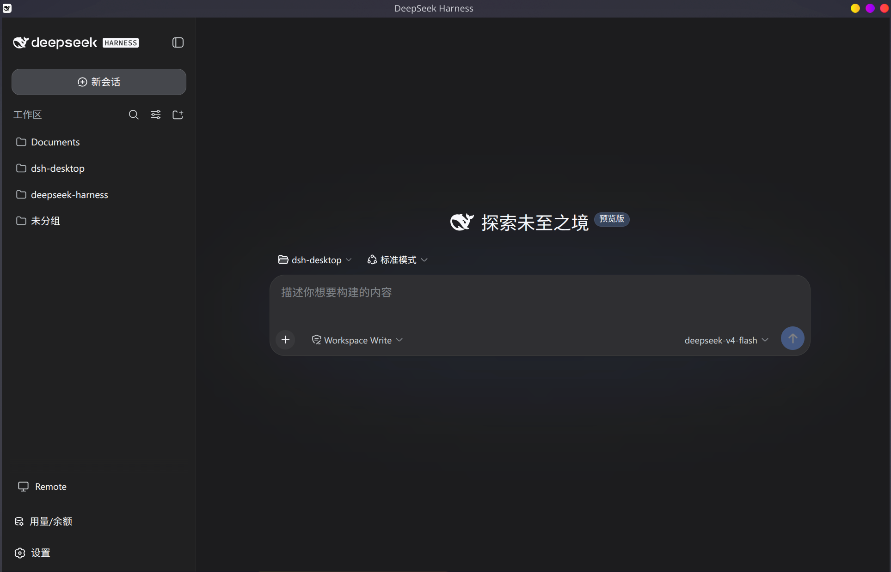
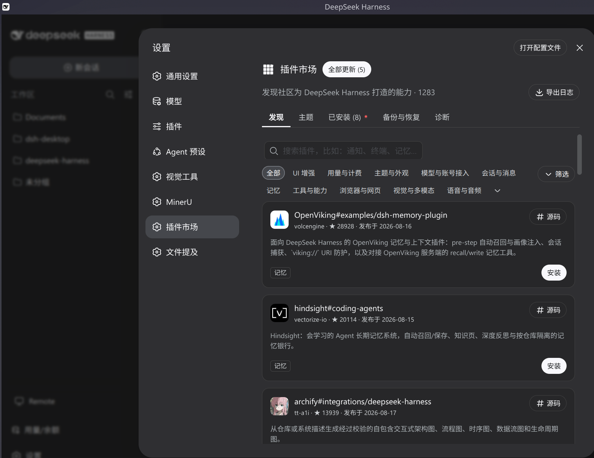

# DSH Desktop

[English](README.md) | [中文](README-cn.md)

A desktop product around the **unmodified** published DeepSeek Harness packages: the full Web UI running with **no Node HTTP server and no port**, composed entirely as Cordis plugins over the `@deepseek-ai/*` family. The desktop shell — the window, tray, and system integration — rides on Electron; every capability (the socketless webserver, the renderer connection, the shell itself) is a plugin row, so each is replaceable from configuration without touching a published package.

- **Upstream project**: [DeepSeek Harness](https://github.com/deepseek-ai/deepseek-harness) — the open-source agent harness this product wraps.
- **Plugin store**: [dsh-market](https://github.com/dsh-market/dsh-market) — the community plugin market, built in.

## Features

### Full Web UI with a zero-socket host

Runs the complete DeepSeek Harness Web UI (session log, tools, model route, agent loop) in a desktop window. The host never binds a socket: a virtual `webServer` interceptor provides the official route-registry contract without a port, the renderer wire client rides an Electron IPC bridge instead of HTTP/WebSocket, and every host route (the `/api` plane, the session-log download, and any plugin route) dispatches in-process. The official `modules`, `ui-theme`, `web-runtime`, and `frontend-static` rows activate unchanged. The interceptor reports a stable virtual port, and the host-side virtual-host transport serves plugins that read `webServer.port` and reach the harness from the main process (dsh-im and similar) in-process too.

### Built-in plugin market

Ships [dshmarket](https://github.com/dsh-market/dsh-market) as the default plugin market: open **Settings → Plugin Market**, browse, search, and one-click install community plugins. The market's `/dsh-market/*` routes dispatch through the in-process host, and the desktop provides the market's host contract (`desktopProfiles` + `desktopPnpm`). Installs run the real `dsh plugin --profile desktop …` CLI, which drives `pnpm` from the system PATH — the desktop appends the standard user tool locations (Homebrew, `~/.local/bin`, `~/.local/share/pnpm`, `~/.npm-global`, `~/.volta`, and nvm) to that PATH, so installing plugins requires `pnpm` in one of those standard locations. Installed plugins load at the next boot through a profile-anchored loader hook.

### System tray and close-to-tray

A system tray (show / restart host / quit) is always present, and its labels follow the app's actual display language. A General-settings preference controls what closing the window does: quit the app, or hide to the tray and keep the host running in the background.

### In-process host reboot

Changes that cannot hot-load (for example a market install that needs a restart) apply through **Restart host** in the settings General section or the tray's **Restart host** item: the host disposes and re-boots in-process, the IPC bridge is re-installed, and the renderer reloads — the Electron process, window, and tray stay up.

### Agent presets shipped

The desktop composes the shipped agent-preset root, so the roster matches `dsh web`: the `standard`, `code`, `minimal`, and `cordis` presets resolve at `system` trust and session start never fails with `preset not found`.

### Boot self-healing

A broken plugin install never blocks the app from opening: bundles whose packages cannot be resolved are dropped from the profile manifest (with a warning) before mount, and the app recovers on the next clean boot.

## Runtime modes

### From source (development)

```sh
pnpm install         # resolves @deepseek-ai/* from the dist-tags recorded in upstream.json
pnpm build           # compile the TypeScript sources (tsc + esbuild + the verify:upstream gate)
pnpm check           # strict type-check + tests for every package
pnpm start           # build, then launch the Electron app
```

### Packaged app

`dsh-plugin-desktop` ships installable artifacts through electron-builder:

```sh
pnpm package:dir      # unsigned unpacked app for the current host (dist/<platform>-unpacked)
pnpm dist:mac         # macOS DMG (on a macOS host)
pnpm dist:win         # Windows x64 NSIS installer (on a Windows host)
pnpm dist:linux       # Linux AppImage + deb + rpm (on a Linux host)
```

### Headless boot proof

The transport is verified headless — a fake bridge and a profile boot run with no browser, no socket, and no window:

```sh
pnpm -r test          # headless boot proof + client carrier tests
```

The Electron window is the runnable shell over the same in-process host the tests boot.

## Continuous integration

GitHub Actions gates every commit and produces installers:

- `.github/workflows/ci.yml` — on every push to `master` and every pull request: `pnpm check` (type-check, compile, and tests for every package) plus a headless `package:dir` packaging proof.
- `.github/workflows/build.yml` — on a `v*` tag, manual dispatch, or a `master` push touching packaging files: builds mac DMG, Windows x64 NSIS, and Linux AppImage + deb + rpm on native runners and uploads the unsigned artifacts.

CI installs the workspace the same way a local checkout does — resolving `@deepseek-ai/*` fresh from the dist-tags in [`upstream.json`](upstream.json), since `pnpm-lock.yaml` is not committed.

## Versioning and releases

Versions follow [Semantic Versioning](https://semver.org), and every release ships a GitHub Release with the installers attached. Commit messages follow [Conventional Commits](https://www.conventionalcommits.org): `feat` bumps minor, `fix` bumps patch, a `BREAKING CHANGE` bumps major.

The flow is automatic:

1. Merge to `master` — `.github/workflows/release-please.yml` inspects the commits since the last release and opens a **release PR** that bumps the version in every `package.json` and updates `CHANGELOG.md`.
2. Merge the release PR — release-please creates the `vX.Y.Z` tag and the GitHub Release.
3. The tag push triggers `.github/workflows/build.yml`, which builds mac DMG, Windows x64 NSIS, and Linux AppImage + deb + rpm on native runners and attaches them (plus a `SHA256SUMS` checksum file) to the Release.

Users download the app from the repository's **Releases** page: macOS picks the DMG, Windows the `-Setup.exe`, Linux the AppImage/deb/rpm.

## Screenshots

> Screenshots are added by the maintainer. The blocks below are placeholders — drop the images into `docs/screenshots/` and update the paths.



*The main window: the full DeepSeek Harness Web UI in the desktop shell.*



*The built-in plugin market: browse, search, and one-click install.*

## References

- **Upstream project** — [DeepSeek Harness](https://github.com/deepseek-ai/deepseek-harness) (`dsh`): the open-source agent harness this desktop wraps. This repository consumes the **published** `@deepseek-ai/*` packages resolved from the dist-tags recorded in [`upstream.json`](upstream.json) (`next` for the dsh family, `latest` for the cordis framework); there is no upstream source checkout here.
- **Plugin store** — [dsh-market](https://github.com/dsh-market/dsh-market) (`dshmarket`): the community plugin market. The desktop ships it as the default market; third-party plugins published to the [awesome-dsh-plugin](https://awesome-dsh-plugin.com) registry appear there.

## Technical overview

### Zero-socket transport

| Piece | Row / package | Replaces |
|---|---|---|
| Socketless webserver | `dsh-plugin-desktop/webserver` | the official `webserver` row (disabled) |
| Renderer wire client | `dsh-plugin-desktop-connection` | the official `connection` row (disabled) — node half re-exports upstream, client half rides Electron IPC |
| Boot manifest | Electron preload (`window.__DSH_BOOT__`) | the server index tap |
| RPC dispatch | `ipcMain` (`connection.createSharedFetchHandler` + `apiProxy`) | the HTTP/WebSocket carrier |
| Virtual-host HTTP proxy | `dsh-plugin-desktop-connection` client + `dispatchHttpRequest` (main) | the host HTTP surface — any webserver route dispatches in-process over IPC |
| Virtual-host WebSocket bridge | `dsh-plugin-desktop-connection` client + `websocket-bridge` (main) | the host WebSocket surface — upgrade routes serve in-process over IPC |
| Host-side virtual-host transport | `host-bridge` (main) | the host-side surface — plugins that read `webServer.port` and reach the harness with `fetch`/`WebSocket` are served in-process (dsh-im and similar) |

### Repository layout

```
upstream.json                    upstream provenance (dist-tags + pinned-copy version/commit)
packages/
  dsh-plugin-desktop/             shell row, virtual webserver, Electron main, packaging
  dsh-plugin-desktop-connection/  renderer wire client over Electron IPC
docs/                            architecture map
.agents/notes/                   Agent Notes (decision records)
```

### Model Experience

The desktop is a presentation and transport surface over the standard DeepSeek Harness agent. It changes no model-facing behavior: the same session log, tools, model route, and agent loop run underneath. The transport (Electron IPC instead of HTTP/WebSocket) and the socketless host are invisible to the model.

### Known limitations

- The Electron shell is minimal: one window plus the IPC bridge. Terminal, profile management, updates, and signed releases are deferred.
- The host reboot is manual (a settings action and a tray item); auto-triggering waits on a durable host-readable signal.
- The renderer `ConnectionController` is a pinned copy of the upstream source; `verify:upstream` fails the build when the installed family differs, forcing a reapply from the recorded commit.
- The desktop keeps a zero-socket host; the `deepseek-harness-desktop` project is the alternative loopback-carrier design for comparison.
- The host-side virtual-host transport serves the standard web APIs (`fetch`/`WebSocket`); a plugin that reaches the harness through raw `node:http`/`https` (e.g. axios without the fetch adapter) has no intercepted path and would need a real socket.
